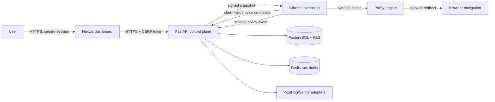

# FocusGuard Architecture

Status: accepted for milestone 1
Last updated: 2026-08-18

## Objective

The first milestone lets a user create and confirm “Block Reddit during work hours,” enroll a Chrome profile, receive a signed policy snapshot, and see a local block page during the scheduled window. Enforcement continues from the last verified snapshot while the API is unavailable.

FocusGuard is a policy platform, not covert monitoring software. Every enrolled client must remain visible, attributable to the user or organization that enrolled it, and removable through an explicit recovery path.

## Components and trust boundaries

Trust boundaries:

1. The browser dashboard is untrusted input. Authorization is recalculated on every API operation.
2. The extension is a potentially hostile client. Device identity narrows access but never grants tenant-admin privileges.
3. PostgreSQL is the authorization backstop. Tenant tables carry `organization_id`; production roles have Row-Level Security enabled and forced.
4. Redis is disposable coordination state, never the source of truth for policy or identity.
5. Telemetry vendors receive explicitly allowlisted, non-browsing fields only.
6. The local device is controlled by the user. An extension cannot defend against an administrator or a user who removes it; stronger assurances require managed browser/OS enforcement.

## Decision flow

1. The extension observes only top-level `http`/`https` navigation.
2. It normalizes the hostname using the platform URL parser.
3. The shared policy engine evaluates active rules in deterministic priority order.
4. `ALLOW` continues normally. `WARN`, `LIMIT`, `BLOCK`, and `ESCALATE` use a local extension page with decision metadata.
5. A minimal event may be queued: policy/rule identifiers, decision, coarse time, and normalized matched domain. Query strings, fragments, titles, content, form values, and unrelated visits are never sent.
6. On synchronization, a new snapshot is accepted only after signature, schema, subject, monotonic version, and validity checks.

## Policy precedence

Policies are filtered by tenant, subject, enabled state, validity, device, schedule, commitment, and focus-session state. Candidate rules are ordered by:

1. policy priority (descending),
2. rule priority (descending),
3. match specificity (descending),
4. restrictive decision rank (descending),
5. stable policy/rule UUID order.

The first match wins. Exceptions are explicit `ALLOW` rules with a higher priority than the broader restriction. This is easier to audit than merging fields from several rules. Locked commitments establish a minimum enforcement rank and cannot be weakened by an ordinary rule or policy edit before expiry.

## Control plane

- User sessions are opaque random tokens. Only a SHA-256 digest is stored; cookies are `Secure`, `HttpOnly`, and `SameSite=Lax` in production.
- Cookie-authenticated mutations require a matching CSRF header.
- Passwords use Argon2id with application-level parameter versioning.
- Device enrollment codes are one-time, short-lived, and stored only as digests.
- Device access credentials are short-lived. Refresh credentials are rotated and replay invalidates the credential family.
- Policy snapshots are signed with an offline-rotatable Ed25519 key. The extension pins approved public key IDs.
- All tenant queries require an authorization context and a PostgreSQL transaction that sets RLS claims.

## Availability and offline behavior

The extension stores only the newest verified snapshot and a small bounded event queue in `chrome.storage.local`. It never falls back from an expired or invalid snapshot to unsigned policy data. The snapshot carries two timestamps:

- `refresh_after`: begin retrying synchronization;
- `valid_until`: last moment the snapshot is authoritative.

Until `valid_until`, normal cached enforcement continues offline. After it expires, the current product uses the policy’s declared fail mode. Locked commitments may fail closed for matched domains; ordinary policies fail open with a visible degraded-health warning. The choice and its safety consequences are shown before activation.

## Browser enforcement limitations

Manifest V3 can cover navigation in the enrolled Chrome profile, including direct URLs and redirects seen by that profile. It cannot reliably prevent:

- disabling or uninstalling an unmanaged extension;
- using an unenrolled Chrome profile, another browser, a VM, or another device;
- editing the system clock (the client can detect large server-time drift but not establish trusted time offline);
- IP navigation when no safe domain/category mapping exists;
- network traffic outside browser APIs.

FocusGuard reports these limitations honestly. Future managed-browser, OS, mobile, and DNS agents share the policy contract but have separate capability declarations.

## Cross-platform evolution

Every client registers its capabilities. Policies compile into a versioned, signed snapshot containing portable conditions plus client-specific supported/enforced flags. Unsupported rules are rejected or visibly downgraded during confirmation; they are never silently treated as enforced. The pure TypeScript engine is the reference semantics for browser clients. Conformance fixtures will allow native clients to reproduce identical decisions.

## Deployment

Cloudflare terminates public TLS and applies coarse abuse controls. Application containers run without root privileges behind an AWS-compatible load balancer. PostgreSQL and Redis are private. Secrets come from the deployment secret manager, not images or source. Egress is allowlisted for telemetry and email. Production signing keys are held in KMS/HSM-backed storage; the API asks the signer for signatures without reading raw key material.

## Related decisions

- [ADR-0001](docs/architecture/ADR-0001-signed-policy-snapshots.md)
- [ADR-0002](docs/architecture/ADR-0002-tenant-authorization.md)
- [ADR-0003](docs/architecture/ADR-0003-minimal-event-telemetry.md)
- [ADR-0004](docs/architecture/ADR-0004-browser-enforcement-boundary.md)
